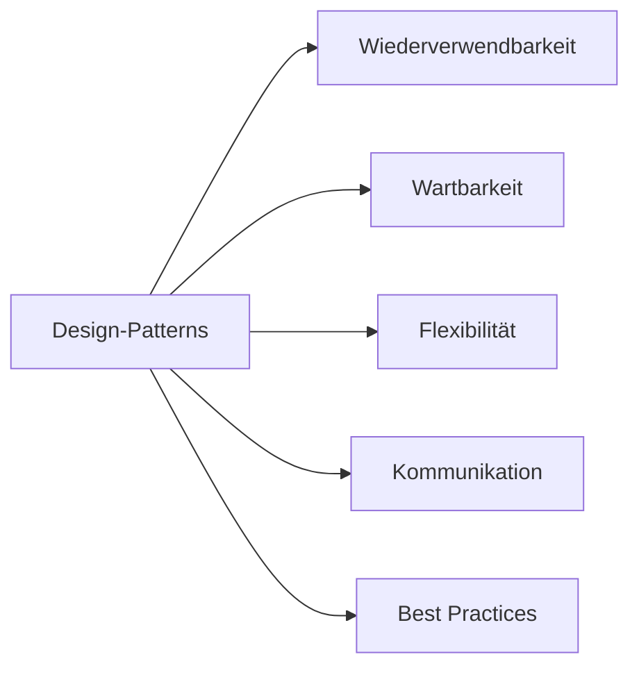
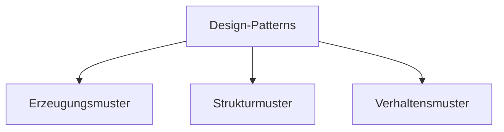
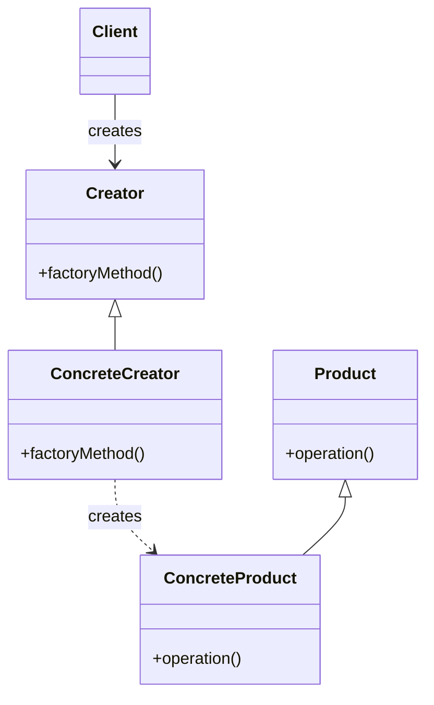
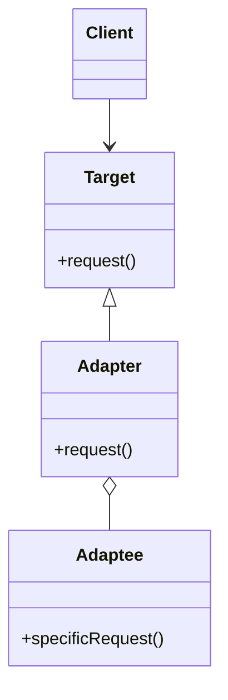
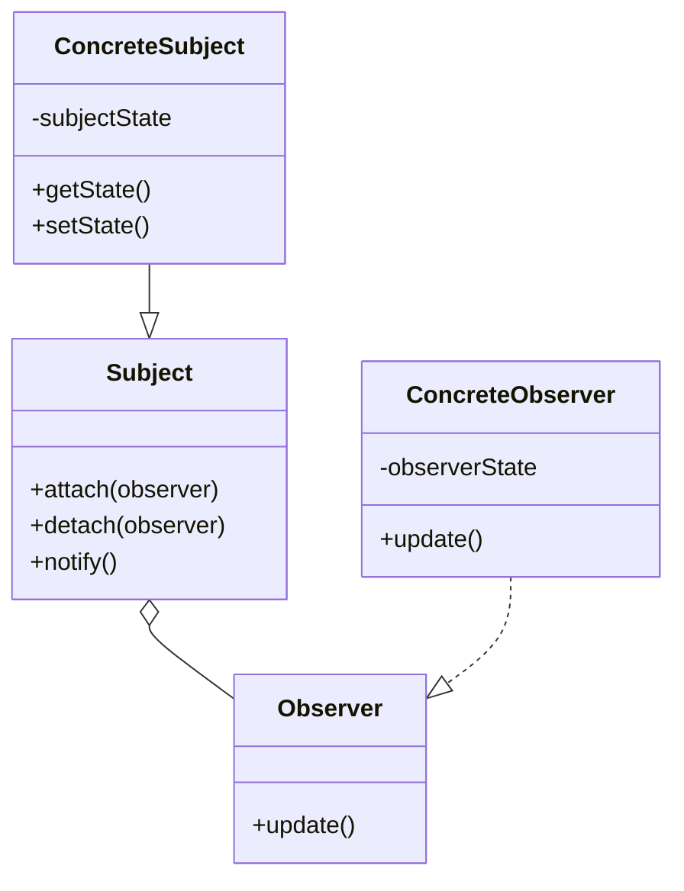

# Übersicht

Design-Patterns sind bewährte Lösungsschablonen für wiederkehrende Entwurfsprobleme in der Softwareentwicklung. Sie bieten erprobte Ansätze, um die Struktur und Interaktion von Klassen und Objekten zu gestalten. Dabei geht es nicht um konkrete Implementierungen, sondern um allgemeine Konzepte.

Die Vorteile von Design-Patterns lassen sich so illustrieren:

Es gibt drei Hauptkategorien von Patterns, die sich anhand ihrer Zwecke unterscheiden:

1. Erzeugungsmuster (Creational Patterns): 
   Sie befassen sich mit der Objekterzeugung und entkoppeln die Erstellung von Objekten von ihrer Verwendung. 

2. Strukturmuster (Structural Patterns):
   Sie befassen sich mit der Zusammensetzung von Klassen und Objekten zu größeren Strukturen. Dabei geht es oft darum, Schnittstellen zu vereinfachen oder zusätzliche Funktionalität hinzuzufügen.

3. Verhaltensmuster (Behavioral Patterns):
   Sie befassen sich mit der Interaktion und Aufgabenverteilung zwischen Objekten. Dabei geht es um flexibles Objektverhalten und die Kapselung von Algorithmen.

Die Diagramme zeigen die grundlegenden Strukturen und Beziehungen einiger ausgewählter Patterns. In den nächsten Abschnitten werden wir sie im Detail besprechen und ihre Umsetzung in C# anschauen.

## Nächste Schritte

[Singleton Pattern](patterns/Singleton%20Pattern.md)