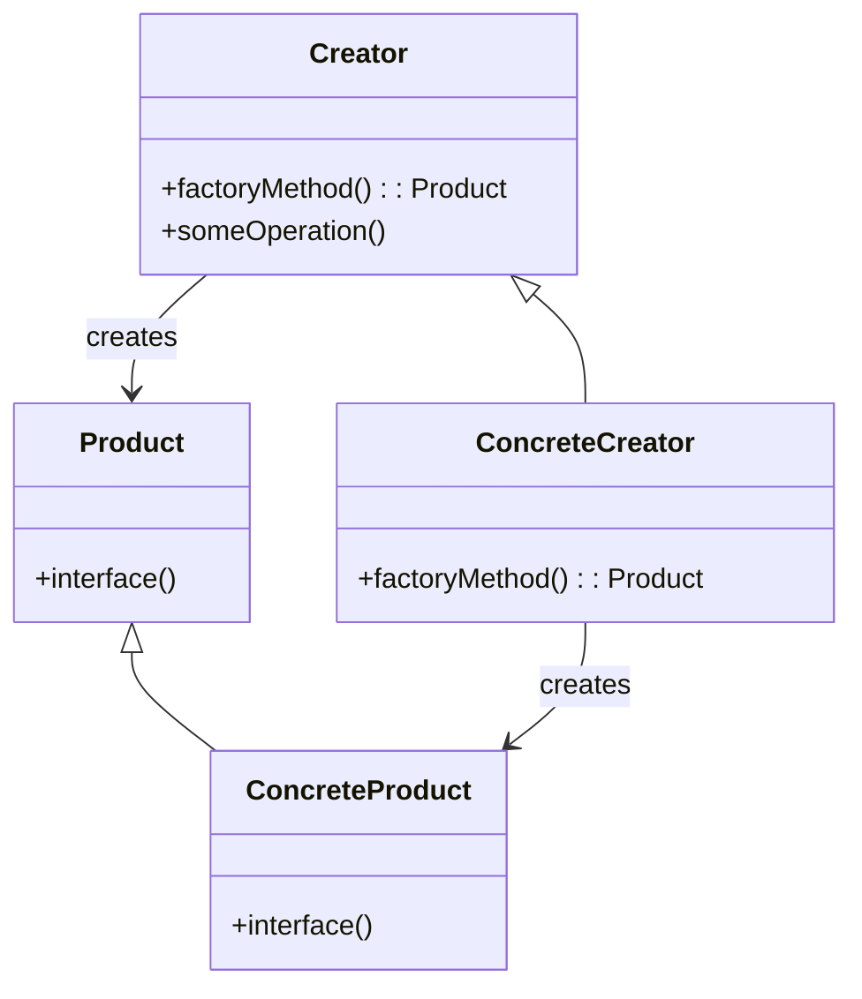

# Factory Method Pattern  <!-- omit from toc -->

- [Einleitung](#einleitung)
- [Implementierung](#implementierung)
- [Anwendung](#anwendung)
- [Best Practices](#best-practices)
  - [Beispiel mit Dependency Injection](#beispiel-mit-dependency-injection)
- [Nächste Schritte](#nächste-schritte)

## Einleitung

Das Factory Method Pattern gehört zur Kategorie der Erzeugungsmuster (Creational Patterns).



## Implementierung

Das Factory Method Pattern definiert eine Schnittstelle zur Erstellung eines Objekts, lässt aber Unterklassen entscheiden, von welcher Klasse das Objekt erstellt werden soll. Es ermöglicht es einer Klasse, die Instanziierung an Unterklassen zu delegieren.

Hier ist eine beispielhafte Implementierung in C#:

```csharp
public abstract class Creator
{
    public abstract Product FactoryMethod();

    public void SomeOperation()
    {
        // Rufe die Factory-Methode auf, um ein Produkt-Objekt zu erhalten
        Product product = FactoryMethod();
        // Verwende das Produkt
        product.Interface();
    }
}

public class ConcreteCreator : Creator
{
    public override Product FactoryMethod()
    {
        return new ConcreteProduct();
    }
}

public abstract class Product
{
    public abstract void Interface();
}

public class ConcreteProduct : Product
{
    public override void Interface()
    {
        Console.WriteLine("ConcreteProduct");
    }
}
```

Wichtige Punkte:

1. Die `Creator`-Klasse deklariert die Factory-Methode, die ein Objekt vom Typ `Product` zurückgibt.
2. Die `ConcreteCreator`-Klasse überschreibt die Factory-Methode, um eine Instanz von `ConcreteProduct` zurückzugeben.
3. Die `Product`-Klasse definiert die Schnittstelle für die Objekte, die von der Factory-Methode erstellt werden.
4. Die `ConcreteProduct`-Klasse implementiert die `Product`-Schnittstelle.

## Anwendung

```csharp
Creator creator = new ConcreteCreator();
creator.SomeOperation();
```

In diesem Beispiel wird `ConcreteCreator` verwendet, um eine Instanz von `ConcreteProduct` zu erstellen und die `SomeOperation`-Methode aufzurufen, die das erstellte Produkt verwendet.

Vorteile:
- Entkoppelt die Erstellung von Objekten von ihrer Verwendung
- Ermöglicht es Unterklassen, die zu erstellenden Objekte zu ändern
- Fördert lose Kopplung zwischen Objekten

Nachteile:
- Kann zu einer Hierarchie von Creator-Klassen führen
- Kann die Komplexität des Codes erhöhen

## Best Practices

1. Trenne die Produkterstellung von der Produktverwendung.
2. Verwende Factory-Methoden, um die Erstellung von Objekten zu kapseln.
3. Definiere eine gemeinsame Schnittstelle für die erstellten Produkte.
4. Lasse Unterklassen entscheiden, welche konkrete Produktklasse erstellt werden soll.
5. Erwäge die Verwendung von Dependency Injection, um die Abhängigkeiten zwischen Objekten zu reduzieren.

### Beispiel mit Dependency Injection

```csharp
public interface IProduct
{
    void Interface();
}

public class ConcreteProduct : IProduct
{
    public void Interface()
    {
        Console.WriteLine("ConcreteProduct");
    }
}

public interface ICreator
{
    IProduct FactoryMethod();
}

public class ConcreteCreator : ICreator
{
    public IProduct FactoryMethod()
    {
        return new ConcreteProduct();
    }
}

public class Client
{
    private readonly ICreator creator;

    public Client(ICreator creator)
    {
        this.creator = creator;
    }

    public void SomeOperation()
    {
        IProduct product = creator.FactoryMethod();
        product.Interface();
    }
}
```

In diesem Beispiel werden Schnittstellen verwendet, um die Abhängigkeiten zwischen den Klassen zu reduzieren. Die `Client`-Klasse hängt von der `ICreator`-Schnittstelle ab, anstatt direkt von einer konkreten Creator-Klasse abzuhängen. Dies ermöglicht es, verschiedene Implementierungen von `ICreator` zu verwenden, ohne den `Client`-Code zu ändern.

Anwendung mit Dependency Injection:

```csharp
ICreator creator = new ConcreteCreator();
Client client = new Client(creator);
client.SomeOperation();
```

Durch die Verwendung von Dependency Injection wird der Code flexibler, testbarer und einfacher zu warten.

Das waren die wichtigsten Informationen zum Factory Method Pattern. Lass mich wissen, wenn Du noch Fragen hast oder weitere Patterns im selben Stil erklärt haben möchtest.

Weitere Informationen zu Dependency Injection findest Du in der [Dependency Injection](Dependency%20Injection.md).

## Nächste Schritte


