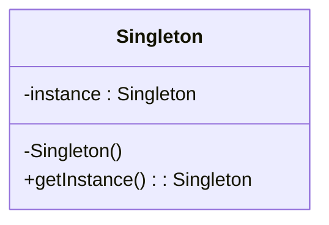

# Singleton Pattern <!-- omit from toc -->

## Inhalt <!-- omit in toc -->

- [Einleitung](#einleitung)
- [Implementierung](#implementierung)
- [Anwendung](#anwendung)
- [Best Practices](#best-practices)
- [Nächste Schritte](#nächste-schritte)

## Einleitung

Das Singleton gehört zur Kategorie der Erzeugungsmuster (Creational Patterns).



## Implementierung

Das Singleton-Pattern stellt sicher, dass eine Klasse genau eine Instanz besitzt und diese über einen globalen Zugriffspunkt bereitgestellt wird. Es ist nützlich, wenn man sicherstellen möchte, dass nur ein einziges Objekt einer Klasse existiert, z.B. bei Konfigurationen, Logging oder Datenbankverbindungen.

Hier ist eine beispielhafte Implementierung in C#:

```csharp
public sealed class Singleton
{
    private static Singleton instance = null;
    private static readonly object padlock = new object();

    private Singleton()
    {
    }

    public static Singleton Instance
    {
        get
        {
            if (instance == null)
            {
                lock (padlock)
                {
                    if (instance == null)
                    {
                        instance = new Singleton();
                    }
                }
            }
            return instance;
        }
    }
}
```

Wichtige Punkte:

1. Der Konstruktor ist privat, damit keine Instanzen von außen erstellt werden können.
2. Die Instanz wird in einer statischen Variable gespeichert und über eine statische Eigenschaft bereitgestellt.
3. Die Eigenschaft prüft, ob bereits eine Instanz existiert. Wenn nicht, wird eine neue erstellt.
4. Der Lock stellt sicher, dass in einem Multithread-Szenario nur eine Instanz erstellt wird.

## Anwendung

```csharp
Singleton s1 = Singleton.Instance;
Singleton s2 = Singleton.Instance;

if (s1 == s2)
{
    Console.WriteLine("Singleton works, both variables contain the same instance.");
}
```

Hier sehen wir, dass `s1` und `s2` auf dieselbe Instanz verweisen, obwohl scheinbar zwei Instanzen erstellt wurden.

Vorteile:
- Kontrollierter Zugriff auf eine einzige Instanz
- Vermeidet globale Variablen und Namenskonflikte

Nachteile:
- Verstößt gegen das Single Responsibility Principle
- Kann Modultests erschweren
- Muss vorsichtig in Multithreading-Umgebungen eingesetzt werden

## Best Practices

Es gibt einige Best Practices und Überlegungen bei der Implementierung des Singleton-Patterns. Hier sind die wichtigsten Punkte:

1. Lazy Initialization:
   Verwende Lazy Initialization, um die Erstellung der Instanz bis zum ersten Gebrauch zu verzögern. So sparst Du Ressourcen, wenn das Singleton nicht immer benötigt wird.

2. Thread-Sicherheit:
   Stelle sicher, dass die Erstellung der Instanz thread-sicher ist, wenn Deine Anwendung mehrere Threads verwendet. Verwende dazu das `lock`-Statement oder noch besser, eine doppelt überprüfte Sperrung (double-checked locking).

3. Vermeide Vererbung:
   Singletons sollten in der Regel versiegelt (sealed) sein, um Vererbung zu verhindern. Andernfalls könnten abgeleitete Klassen eigene Instanzen erstellen und so die Singleton-Eigenschaft brechen.

4. Berücksichtige Serialisierung:
   Wenn Dein Singleton serialisierbar sein soll, stelle sicher, dass die Deserialisierung nicht zu einer zweiten Instanz führt. Implementiere dazu die Methoden `OnSerializing` und `OnDeserialized`.

5. Verwende Dependency Injection:
   Anstatt das Singleton direkt aufzurufen, ziehe in Betracht, es über Dependency Injection bereitzustellen. So wird der Code testbarer und entkoppelter.

6. Lazy<T> in .NET 4 und höher:
   Ab .NET 4 gibt es die `Lazy<T>`-Klasse, die eine thread-sichere Lazy Initialization ohne explizites Locking ermöglicht.


Hier ist ein Beispiel, das die oben genannten Best Practices berücksichtigt, einschließlich Serialisierung und Dependency Injection:

```csharp
using System;
using System.Runtime.Serialization;

public sealed class Singleton : ISerializable
{
    private static readonly Lazy<Singleton> lazy = new Lazy<Singleton>(() => new Singleton());

    public static Singleton Instance { get { return lazy.Value; } }

    private Singleton()
    {
        // Verhindere Erstellung über Reflektion
        if (lazy.IsValueCreated)
        {
            throw new InvalidOperationException("Singleton already initialized");
        }
    }

    // Serialisierungskonstruktor
    private Singleton(SerializationInfo info, StreamingContext context)
    {
        // Stelle sicher, dass die Deserialisierung nicht zu einer zweiten Instanz führt
        if (Instance != null)
        {
            throw new InvalidOperationException("Singleton already initialized");
        }
    }

    // Serialisierungsmethode
    public void GetObjectData(SerializationInfo info, StreamingContext context)
    {
        // Leere Implementierung, da keine Instanzvariablen serialisiert werden müssen
    }

    // Beispielmethode
    public void SomeMethod()
    {
        Console.WriteLine("Singleton method called");
    }
}

// Beispielklasse für Dependency Injection
public class MyService
{
    private readonly Singleton singleton;

    public MyService(Singleton singleton)
    {
        this.singleton = singleton;
    }

    public void DoSomething()
    {
        singleton.SomeMethod();
    }
}
```

Erklärung:

1. Lazy Initialization:
   Die Instanz wird erst bei der ersten Verwendung mit `Lazy<T>` erstellt.

2. Thread-Sicherheit:
   `Lazy<T>` stellt sicher, dass die Erstellung thread-sicher ist.

3. Vermeide Vererbung:
   Die Klasse ist `sealed`, um Vererbung zu verhindern.

4. Berücksichtige Serialisierung:
   Die Klasse implementiert `ISerializable` und bietet einen Serialisierungskonstruktor und eine `GetObjectData`-Methode. Diese stellen sicher, dass die Deserialisierung nicht zu einer zweiten Instanz führt.

5. Verwende Dependency Injection:
   Die `MyService`-Klasse zeigt, wie das Singleton per Konstruktor-Injection bereitgestellt werden kann.

6. Lazy<T> in .NET 4 und höher:
   Die Implementierung verwendet `Lazy<T>` für die thread-sichere Lazy Initialization.

Anwendung:

```csharp
// Direkte Verwendung
Singleton.Instance.SomeMethod();

// Dependency Injection
var service = new MyService(Singleton.Instance);
service.DoSomething();
```

Dieses Beispiel zeigt eine umfassende Implementierung des Singleton-Patterns unter Berücksichtigung der genannten Best Practices. Es stellt sicher, dass nur eine Instanz erstellt wird, auch bei Serialisierung und Reflektion, und ermöglicht die Verwendung von Dependency Injection für bessere Testbarkeit und Entkopplung.

## Nächste Schritte

[Factory Method](Factory%20Method.md)